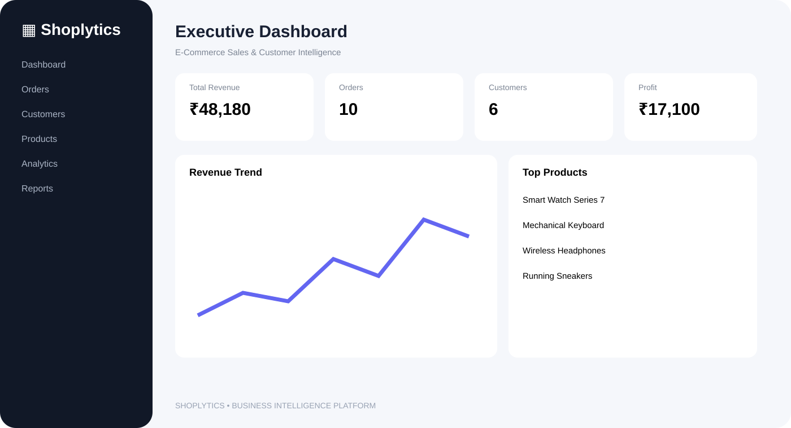
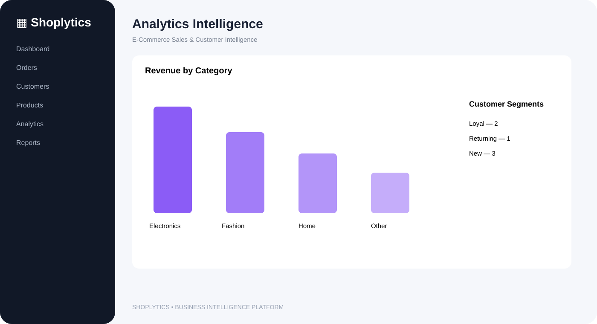
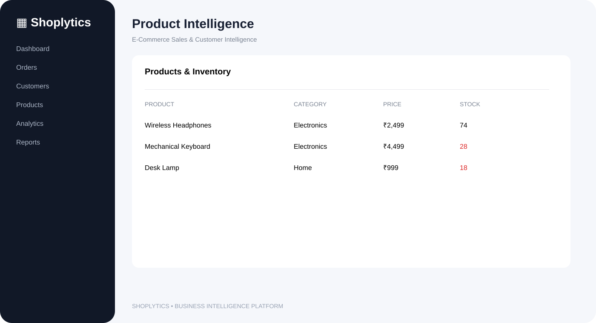

<div align="center">

# 🛍️ Shoplytics

### E-Commerce Sales & Customer Intelligence Platform

**Turn e-commerce data into business decisions.**

   

**Sales • Customers • Products • Inventory • Orders • Analytics • Reports**

</div>

---

## ✨ About

**Shoplytics** is a full-stack e-commerce business intelligence dashboard that brings sales, revenue, customers, products, inventory and orders into one modern admin interface.

> 📊 **One dashboard. Complete business visibility.**

## 🚀 Features

- 📊 **Executive Dashboard** — revenue, orders, customers, profit and AOV
- 🛒 **Order Management** — track orders, payments and statuses
- 👥 **Customer Intelligence** — profiles, purchase activity and lifetime spend
- 📦 **Product Management** — catalog, pricing and stock controls
- 📈 **Business Analytics** — revenue trends, category performance and top products
- 🎯 **Customer Segmentation** — new, returning, loyal and at-risk insights
- 📉 **Inventory Monitoring** — low-stock detection and quick adjustments
- 📑 **CSV Reports** — export orders, products and customers
- 🔐 **Authentication** — JWT sessions with HTTP-only cookies
- 🌱 **Demo Data** — seeded data for instant testing

---

## 🖥️ Screenshots

### 📊 Executive Dashboard


### 📈 Analytics Intelligence


### 📦 Product & Inventory Management


---

## 🎯 Business Questions Shoplytics Answers

| Question | Insight |
|---|---|
| How much are we selling? | Revenue & order KPIs |
| Which products perform best? | Product revenue & units |
| Which categories drive sales? | Category analytics |
| Who are our valuable customers? | Lifetime spend & segments |
| Are customers returning? | Customer order frequency |
| What needs restocking? | Low-stock monitoring |
| How profitable are sales? | Revenue minus product cost |
| Need data outside the dashboard? | CSV reports |

---

## 🏗️ Architecture

```text
┌─────────────────────────────────────────────┐
│              Shoplytics UI                  │
│          HTML • CSS • JavaScript             │
└──────────────────────┬──────────────────────┘
                       │ REST API
                       ▼
┌─────────────────────────────────────────────┐
│             Express.js Server               │
│     Auth • CRUD • Analytics • Reports       │
└──────────────────────┬──────────────────────┘
                       │
                       ▼
┌─────────────────────────────────────────────┐
│              SQLite Database                │
│ Users • Customers • Products • Orders       │
│                 • Items                     │
└─────────────────────────────────────────────┘
```

## 🛠️ Tech Stack

**Frontend:** HTML5, CSS3, JavaScript, Fetch API, Responsive UI

**Backend:** Node.js, Express.js, REST APIs, JWT, HTTP-only Cookies

**Database:** SQLite + Better-SQLite3

**Reporting:** CSV exports + analytics endpoints

---

## 📁 Project Structure

```text
Shoplytics-ecommerce-analytics/
├── public/
│   ├── index.html
│   ├── app.js
│   └── app.css
├── docs/
│   ├── dashboard.svg
│   ├── analytics.svg
│   └── products.svg
├── data/
├── server.js
├── seed.js
├── package.json
├── .env.example
├── .gitignore
└── README.md
```

---

## ⚡ Getting Started

### 1. Clone

```bash
git clone https://github.com/Mohitrath/Shoplytics-ecommerce-analytics.git
cd Shoplytics-ecommerce-analytics
```

### 2. Install

```bash
npm install
```

### 3. Configure

Create `.env`:

```env
PORT=4000
JWT_SECRET=change-this-in-production
DB_FILE=./data/shoplytics.db
```

### 4. Seed demo data

```bash
npm run seed
```

### 5. Start

```bash
npm run dev
```

Open **http://localhost:4000**

---

## 🔐 Demo Login

```text
Email:    admin@shoplytics.local
Password: Admin@123
```

> ⚠️ Change the demo credentials and JWT secret before production use.

---

## 🔌 REST API

### Authentication
```text
POST /api/auth/login
POST /api/auth/logout
GET  /api/auth/me
```

### Analytics
```text
GET /api/analytics/overview
GET /api/analytics/revenue
GET /api/analytics/categories
GET /api/analytics/top-products
GET /api/analytics/customer-segments
```

### Products
```text
GET    /api/products
POST   /api/products
DELETE /api/products/:id
PATCH  /api/products/:id/stock
```

### Customers & Orders
```text
GET  /api/customers
POST /api/customers
GET  /api/orders
GET  /api/orders/:id
PATCH /api/orders/:id/status
```

### Reports
```text
GET /api/reports/orders.csv
GET /api/reports/products.csv
GET /api/reports/customers.csv
```

---

## 🔒 Security

- bcrypt password hashing
- JWT authentication
- HTTP-only cookies
- SameSite cookie protection
- Parameterized SQL queries
- Environment-based secrets

## 📈 Roadmap

- [ ] PostgreSQL production database
- [ ] Role-based access control
- [ ] RFM customer analysis
- [ ] Churn prediction
- [ ] Sales forecasting
- [ ] AI recommendations
- [ ] Automated email reports
- [ ] Dark mode
- [ ] Docker deployment
- [ ] Multi-store support

---

## 👨‍💻 Author

**Mohit Rath**

Full-stack e-commerce analytics and business intelligence project.

<div align="center">

### ⭐ Star the repository if you like Shoplytics!

**Shoplytics — Understand your store. Understand your customers. Grow smarter.**

</div>
